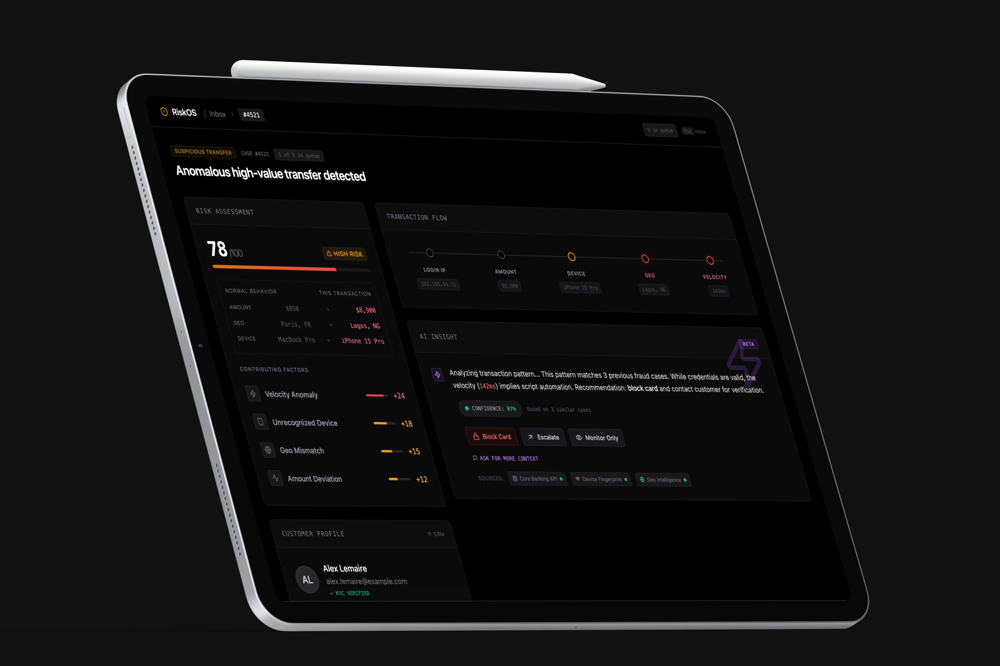

# RiskOS

## Expérimentation UX agentiques · Détection de fraude

Victor Soussan · Product Design
Catégorie : Expérimentation UX agentiques

---

`image:hero`

---

## Intention et cadre de l'expérimentation

Quand on intègre un agent IA dans un flux de décision, une tension apparaît immédiatement : si l'agent est trop présent, l'humain décroche, se repose sur la machine et finit par valider sans lire. Si l'agent est trop discret, il ne sert à rien. Je voulais comprendre où se situe l'équilibre, concrètement, dans une interface.

J'ai choisi la détection de fraude bancaire comme terrain d'expérimentation. Les enjeux y sont mesurables : chaque seconde de latence cognitive coûte de l'argent, 80 % des alertes sont des faux positifs, et l'analyste doit garder la main sur la décision finale. Un contexte qui ne pardonne pas les abstractions.

RiskOS est le prototype que j'ai construit pour tester mes hypothèses sur la collaboration humain/IA en situation de pression.

---

## Le problème : 80 % de faux positifs, zéro contextualisation

Les analystes fraude des néobanques européennes traitent 80 à 150 alertes par shift de 8 heures. 80 % sont des faux positifs. Le temps passé à les disqualifier est du temps que l'analyste ne passe pas sur les vrais cas.

L'outillage de beaucoup d'équipes aujourd'hui : un tableau CSV, un terminal, des règles statiques. Pas de contextualisation. Pas de priorisation intelligente.

---

`video:06-before-after.mp4`
**Données brutes comparées à l'interface structurée.**
À gauche, le flux d'alertes tel qu'il arrive dans beaucoup d'établissements : un CSV brut, des colonnes de données sans hiérarchie visuelle. À droite, les mêmes données dans RiskOS. Le coût cognitif de l'interface actuelle devient tangible.

---

## Trois principes de design pour l'interface

Comment concevoir une interface où l'IA qualifie une alerte en temps réel, sans retirer à l'analyste le contrôle de la décision ?

Trois principes guident le prototype :
- L'IA prépare le terrain cognitif de l'analyste. Elle ne décide pas à sa place.
- Le raisonnement de l'agent est visible, pas seulement son résultat.
- Chaque action a des conséquences traçables dans l'écosystème réel.

---

`video:07-data-flow.mp4`
**Où se positionne RiskOS dans la chaîne de détection.**
Le parcours d'une transaction suspecte : du core banking au moteur de règles, de la file d'alertes à l'analyse IA, jusqu'à la décision humaine. RiskOS intervient au moment où l'alerte a besoin d'un jugement, pas d'une règle supplémentaire.

---

## Priorisation et triage des alertes

L'analyste ouvre son poste de travail. L'inbox affiche 5 cas ouverts, triés par risque. Le filtrage par niveau (high, medium, low) concentre l'attention sur les cas critiques. Un compteur de session rappelle ce qui a été traité et ce qui reste.

`video:01-hero-triage.mp4`
**Frustration :** l'analyste perd du temps à scanner une liste non priorisée pour repérer les cas urgents.
**Bénéfice :** le codage couleur, le filtre par risque et le compteur dynamique réduisent le triage à quelques secondes.

---

## Analyse IA avec raisonnement visible

L'agent IA analyse le cas en temps réel. Le texte apparaît mot par mot : pattern matching, analyse comportementale, recommandation. Les tokens sensibles (montants, géolocalisations, devices) se colorent pour guider l'attention. Un indicateur de confiance quantifie la certitude de l'analyse. Les sources de données (Core Banking API, Device Fingerprint, Geo Intelligence) s'affichent pour montrer sur quoi l'analyse s'appuie.

Les boutons d'action n'apparaissent qu'après le streaming complet. Ce choix impose un temps de lecture minimum. Il empêche la décision réflexe.

`video:02-ai-insight.mp4`
**Frustration :** l'analyste reçoit un score de risque sans comprendre pourquoi. Il doit reconstruire le raisonnement mentalement, à partir de données éparses.
**Bénéfice :** l'IA structure les signaux faibles en une lecture narrative. L'analyste comprend le « pourquoi » avant de décider le « quoi ».

---

## Prise de décision et traçabilité de l'impact

L'analyste choisit une action : bloquer, escalader ou monitorer. La confirmation récapitule le cas, l'action et la durée de review. Deux éléments montrent que l'action ne reste pas dans l'outil : le message Slack envoyé à l'équipe #fraud-ops, et le SMS reçu par le client dont la carte a été gelée.

L'escalade vers le niveau 2 inclut une note pré-remplie par l'IA, que l'analyste peut éditer. L'escalade arrive documentée chez le L2, pas comme une alerte de plus dans une file.

`video:03-decision-ellipses.mp4`
**Frustration :** l'analyste agit dans l'outil mais ne voit jamais la conséquence de sa décision. L'escalade part dans le vide.
**Bénéfice :** chaque action a un écho visible dans l'écosystème (Slack, SMS, ticket). L'analyste sait que sa décision a été transmise et exécutée.

---

## Qualification rapide des faux positifs

Un cas à risque moyen (score 45, paiement de 450 euros). L'IA conclut : « Transaction within acceptable range. Consistent patterns. Mark as safe. » L'analyste confirme en un clic. Résolu en 8 secondes.

`video:05-false-positive.mp4`
**Frustration :** les faux positifs consomment autant de temps que les cas réels, alors qu'ils ne nécessitent aucune action.
**Bénéfice :** l'IA qualifie les faux positifs en quelques secondes. L'analyste garde son attention pour les cas qui comptent.

---

## Traitement séquentiel et métriques de productivité

L'analyste traite 5 cas d'affilée. Chaque confirmation propose directement le cas suivant. La barre de session se met à jour en temps réel. Au dernier cas, un écran récapitule : 5 cas traités, 92 secondes au total, 18 secondes de moyenne.

`video:04-queue-cleared.mp4`
**Frustration :** chaque changement de cas impose une reprise de contexte. L'analyste perd le rythme.
**Bénéfice :** le chaînage direct et les métriques de session maintiennent le flux de travail et rendent la productivité visible.

---

## Ce que j'ai appris

Intégrer l'IA dans un flux de décision ne se résout pas par l'automatisation. Le vrai sujet est de distribuer l'autorité entre l'agent et l'humain, à chaque étape.

Trois mécanismes ont bien fonctionné dans cette expérimentation.

Le premier concerne la confiance. Quand l'IA montre son raisonnement en temps réel (le streaming mot par mot), l'analyste peut commencer à évaluer avant la fin de l'analyse. La transparence du processus construit la confiance mieux qu'un score affiché après coup.

Le deuxième est un frein intentionnel. Retarder l'apparition des boutons d'action jusqu'à la fin de l'analyse IA impose un temps de lecture. En situation de pression temporelle, ça protège contre la décision réflexe sans ralentir le flux de travail de manière perceptible.

Le troisième touche à la traçabilité. Montrer la notification Slack, le SMS client, le ticket de suivi après une action transforme l'outil en nœud d'un réseau. L'analyste voit que sa décision a des conséquences concrètes. Ça renforce la responsabilité et, accessoirement, la satisfaction de travail.

Ces mécanismes sont transposables à d'autres contextes où l'IA assiste une décision humaine : conformité, triage médical, modération de contenu, gestion d'incidents.

---

## Périmètre technique

Prototype fonctionnel. React 18, Vite, Tailwind CSS, lucide-react. Dark mode, desktop. Web Audio API pour le feedback sonore. Déployé sur Vercel.

`link:prototype` https://riskos-gulcbxw52-hugos-projects-0ac0cf31.vercel.app
`link:github` https://github.com/marcus-clay/riskos-fraud-detection
